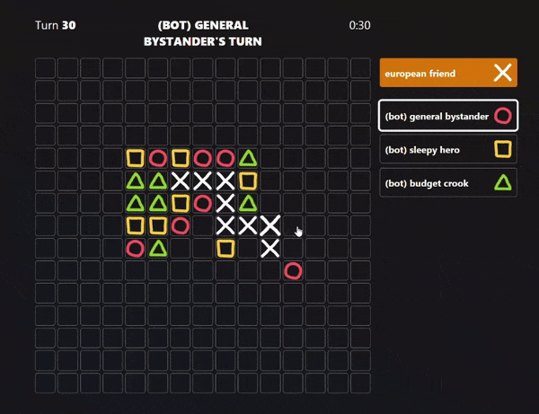
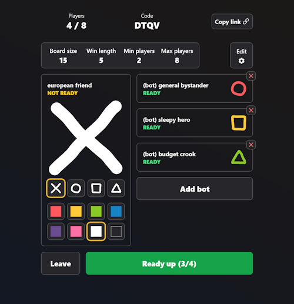

# pixelgame

Online [m,n,k game](https://en.wikipedia.org/wiki/M,n,k-game), but for m == n <= 20

Inspired by https://github.com/fly-apps/tictac

## AAAA Gameplay!



## New shapes, colors, and ruthless AI!



## Play classics or make your own rules!


## Development

- `source .env.dev`
- `mix setup`
- `mix phx.server` or `iex -S mix phx.server`

### Browserslist: caniuse-lite is outdated.

- Update Tailwind version in config/config.exs
- `mix tailwind.install`

### Local PostgreSQL Setup

See `config/dev.exs` for username, password, dbname. It should just work but see below in case.

Set postgres user password in case it changed

```sh
sudo -u postgres psql
\password postgres
```

If you want to setup a different user

```sh
sudo -u postgres createuser <username>
sudo -u postgres createdb <dbname>
sudo -u postgres psql
```

```sql
alter user <username> with encrypted password '<password>';
grant all privileges on database <dbname> to <username> ;
```
